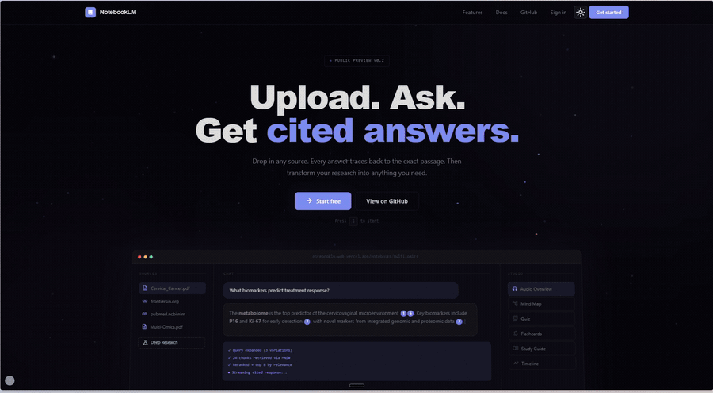

<div align="center">

# notebooklm-web

**An open-source, self-hostable, local-first NotebookLM. Built end to end in four days.**

Three-stage hybrid retrieval. Self-critiquing deep research. Two-voice audio overviews. Mind maps, flashcards, quizzes, study guides. Twelve AI providers with encrypted credentials. One Next.js app, one Postgres, one deploy.

[](https://github.com/hallelx2/notebooklm-web/stargazers)
[](https://github.com/hallelx2/notebooklm-web/network/members)
[](LICENSE)
[](docs/demo/NotebookLM-in-Four-Days-Whitepaper.pdf)



*A 28-second tour at 25× speed. Drop in a PDF, chat with citations, run multi-round web research, generate a two-host audio overview, and walk a mind map of your sources.*

</div>

---

## What you get

- 📚 **Drop in any source** — PDF, web link, pasted text, or audio. Every source walks the same parse → chunk → embed → store pipe.
- 💬 **Chat with citations** — three-stage retrieval (query expansion → hybrid pgvector + keyword → LLM rerank). Every claim cites the chunk it came from. Click a citation to jump to the source.
- 🔬 **Deep research** — multi-round web research with self-critique. The agent plans sub-questions aware of your existing notebook, fetches sources via Exa or Tavily, summarises, drafts the report section by section, scores its own quality, fills gaps in a second round, and cross-references every claim. Output saves as a new source you can chat with.
- 🎙️ **Two-voice audio overviews** — Deepgram Aura's Orion + Asteria voices, scripted as a podcast conversation, rendered as MP3.
- 🧠 **Studio outputs** — mind maps (markmap), flashcards, quizzes (with scoring), study guides, briefing docs, FAQs, timelines, and user-authored notes. Eight kinds, one table.
- 🔌 **Twelve AI providers** — OpenAI, Anthropic, Google Gemini, Mistral, Cohere, Voyage, Groq, Ollama (self-hosted), OpenRouter, Together AI, xAI, and any OpenAI-compatible endpoint. Switch providers per user, no code changes.
- 🔐 **Encrypted credentials** — AES-GCM at rest with versioned keys and userId as AAD. Plaintext API keys never live in the database.
- 📐 **Multi-dimensional embeddings** — sibling tables for 768/1024/1536/3072 dims. Switching embedding models is non-destructive.
- 📡 **Streaming everywhere** — NDJSON over POST for orchestration, AI SDK streamText for chat. Every step the agent takes is a UI event.

## Why this project

Most "build a NotebookLM clone" tutorials ship a 200-line demo that breaks the moment you put it in front of a real user. This is the opposite — a real, shipped, opinionated implementation that you can study, fork, run yourself, or use as the substrate for your own product.

The full architectural breakdown — every chapter, every code path, every decision — is in **[the 45-page whitepaper](docs/demo/NotebookLM-in-Four-Days-Whitepaper.pdf)**. If you are building anything RAG-flavoured right now, that PDF is the cheat sheet.

## ⭐ If this is useful

- **Star the repo** — the cheapest signal that helps the project find more builders
- **Fork it** — clone it, run it, rip out what you do not need, ship your version
- **Open issues** — bug reports, feature requests, architectural feedback all welcome
- **Send PRs** — see the Contributing section below
- **Share it** — if you build something on top, link back so others can find your work

## Quick start

You will need: [Bun](https://bun.sh), a [Neon](https://neon.tech) Postgres database (or any Postgres with pgvector), and an API key from at least one of the supported AI providers.

```bash
git clone https://github.com/hallelx2/notebooklm-web.git
cd notebooklm-web
bun install
cp .env.example .env       # fill in DATABASE_URL, AUTH_SECRET, MASTER_KEY_V1
bun run db:push            # push the Drizzle schema + create pgvector extension
bun run db:hnsw            # create HNSW indexes on the embedding sibling tables
bun run dev                # http://localhost:3000
```

First-time signup walks you through picking a chat provider and an embedding provider in `/settings`. Drop in your API keys, pick your models, and start building notebooks.

### Desktop

The same workbench is available as a native Electron app under `apps/desktop` — runs against an embedded PGlite database with local-FS storage, fully offline against Ollama. See [`apps/desktop/README.md`](apps/desktop/README.md) for the quick-start and keyboard shortcuts.

```bash
bun --filter @notebooklm/desktop dev
```

## Stack

| Layer | Tool | Notes |
|---|---|---|
| Framework | **Next.js 16** | App Router, Route Handlers for streaming, Server Components |
| Runtime | **Bun** | Package manager + dev server |
| Auth | **Better Auth** | Sessions, OAuth, email/password |
| Database | **Drizzle + Neon Postgres** | Serverless HTTP, branching, pgvector |
| Vectors | **pgvector** ×4 sibling tables | 768 / 1024 / 1536 / 3072 dim, HNSW cosine indexes |
| AI Layer | **AI SDK v6** | Uniform `LanguageModel` interface across 12 providers |
| RPC | **tRPC v11** | Notebooks, sources, studio, providers, AI config |
| TTS | **Deepgram Aura** | Orion (male) + Asteria (female) for two-host audio |
| Web search | **Exa + Tavily + SearxNG** | Two paid APIs and one OSS fallback. Pluggable order via `SEARCH_PROVIDER_ORDER`. |
| Web extract | **@mozilla/readability** | Article extraction from arbitrary URLs |
| Storage | **S3 / R2 / Supabase** | Pluggable behind `StorageService` |
| Mind maps | **markmap-lib** | Markdown headings → interactive SVG |
| UI | **React 19 + Tailwind v4** | Three-pane workbench, modal viewers per studio kind |

## Architecture at a glance

```
Browser                    Next.js Server                Shared Libs            External

Notebook UI         →      /api/chat (streamText)    →   lib/retrieve.ts   →   12 LLM providers
3-pane workbench    →      /api/deep-research        →   lib/ingest        →   Deepgram Aura
sources · chat ·    →      /api/studio/audio         →   lib/ai/factory    →   Neon Postgres
studio              →      tRPC routers                                         + pgvector ×4
```

Read the **[whitepaper](docs/demo/NotebookLM-in-Four-Days-Whitepaper.pdf)** for the full version — sixteen chapters, ~45 pages, every decision explained.

## Project layout

```
src/
  app/
    api/                 # Streaming Route Handlers (chat, deep-research, studio, upload, reembed)
    auth/                # Sign-in, sign-up
    notebooks/           # Notebook list + workbench
    settings/            # Provider config, model picker, profile
  components/            # ui / shared / layout
  db/
    schema.ts            # Drizzle schema (users, notebooks, sources, chunks, embeddings ×4, etc.)
    migrate-hnsw.ts      # HNSW index migrations
  lib/
    retrieve.ts          # The three-stage retrieval pipeline (229 lines)
    ingest/              # parse · chunk · embed · store
    ai/
      providers.ts       # The 12-provider registry
      factory.ts         # User-scoped chat/embed model factory
    crypto/              # AES-GCM encrypted credentials
    auth.ts              # Better Auth config
  module/                # Feature modules (notebook, notebooks, settings, auth, landing)
  server/
    routers/             # tRPC routers (notebook, source, studio, provider, aiConfig, message)
docs/
  demo/                  # Demo GIF, MP4, whitepaper PDF
```

## Configuration

All env vars live in `.env`. The minimum for local development:

```bash
DATABASE_URL="postgres://..."             # Neon, Supabase, or any Postgres with pgvector
AUTH_SECRET="..."                          # 32+ random bytes; openssl rand -base64 32
MASTER_KEY_V1="..."                        # 32 bytes for AES-GCM credential encryption
NEXT_PUBLIC_APP_URL="http://localhost:3000"
```

Optional but useful:

```bash
DEEPGRAM_API_KEY="..."                          # Required for audio overviews
EXA_API_KEY="..."                               # Paid; deep-research web search
TAVILY_API_KEY="..."                            # Paid; fallback web search
SEARXNG_URL="http://localhost:8080"             # OSS; self-hosted SearxNG instance
SEARCH_PROVIDER_ORDER="exa,tavily,searxng"      # Comma-separated priority order
SUPABASE_URL="..."                              # If using Supabase Storage
SUPABASE_SERVICE_ROLE_KEY="..."
S3_*                                            # If using S3 / R2 instead
```

User AI provider API keys are **not** environment variables — users add them through the settings UI per-user, encrypted at rest.

### Self-hosting SearxNG

SearxNG aggregates Google / Bing / DuckDuckGo / Wikipedia behind one JSON API and is the OSS option that lets users run deep-research without paid keys. A ready-to-run Docker setup lives at [`docker/searxng/`](docker/searxng/):

```bash
cd docker/searxng
export SEARXNG_PORT=8888
export SEARXNG_SECRET=$(openssl rand -hex 32)
docker compose up -d

# point the app at it
export SEARXNG_URL=http://localhost:${SEARXNG_PORT}
```

The desktop app **auto-starts the same compose stack on first launch** when Docker is available — no setup needed beyond installing Docker Desktop. See [`docker/searxng/README.md`](docker/searxng/README.md) for details, tear-down, and tuning.

Public instances (e.g. `https://searx.be`) work for testing but rate-limit unpredictably — self-host for production. Full SearxNG reference: <https://docs.searxng.org/admin/installation.html>

## Development

```bash
bun run dev             # Next.js dev server
bun run db:push         # Push Drizzle schema changes
bun run db:hnsw         # Create HNSW indexes (idempotent)
bun run db:reembed      # Backfill embeddings under a different model
bun run lint            # Biome lint
bun run format          # Biome format
bun run typecheck       # tsc --noEmit
bun run build           # Production build
```

## Deploy

Built for **Vercel**. Push to a connected GitHub repo, set env vars in the Vercel dashboard, and deploy. The streaming routes use `maxDuration: 300` to fit deep-research and audio-generation runs comfortably under the function timeout.

For self-hosting, the app runs anywhere Node 20+ runs — Docker, Render, Fly, your own VM. The only hard requirement is a Postgres with pgvector enabled.

## Roadmap

> **Three companion documents** live alongside this README and go deeper on each direction:
> - [`ROADMAP.md`](ROADMAP.md) — phased plan from v1 through marketplace
> - [`CONTRIBUTING.md`](CONTRIBUTING.md) — how to land a useful PR
> - [`docs/AGENT-HARNESS.md`](docs/AGENT-HARNESS.md) — the technical vision for pluggable agent runtimes

The big direction this project is heading is **a fully local desktop app** — same workbench, same retrieval, same studio kinds, but with no cloud dependencies and no API keys required. Drop a folder of PDFs onto your laptop, open the app, and learn from them entirely offline.

To get there, the repo will move to a **pnpm workspace** so the web app and the desktop app can share a common core (`packages/core`: retrieval, ingest, AI factory, schema, prompts) while each app owns its own surface (`apps/web` for the hosted Next.js version, `apps/desktop` for the local Electron or Tauri shell).

The local stack we are aiming at:

| Layer | Local choice | Notes |
|---|---|---|
| Chat models | **Ollama** | Llama 3.3, Qwen 2.5, Mistral, anything served on `localhost:11434` |
| Embedding models | **Ollama** (Nomic, mxbai) or **GGUF** | 768- or 1024-dim, local inference |
| TTS | **Piper** or **Kokoro-82M** | Free, offline, no Deepgram dependency |
| Database | **Embedded Postgres** or **SQLite + sqlite-vec** | No Neon connection, runs in-process |
| Web search | **Optional** | Local-only mode skips deep-research's web stage; offline still has retrieval, studio, audio |
| Storage | **Local filesystem** | The user's own folders are the canonical store |
| Shell | **Tauri 2** or **Electron** | Native window, drag-and-drop folders, file watcher |

The shape of the work: the existing `lib/ai/factory.ts`, `lib/retrieve.ts`, `lib/ingest`, and the studio router are already provider-agnostic — Ollama is supported in the registry today. Pulling them into `packages/core`, swapping Neon for an embedded DB, and replacing Deepgram with Piper at the TTS boundary is the bulk of the desktop port.

## Contributing

Yes please. The contributions I am most excited to see:

- 💻 **The desktop app.** Tauri or Electron shell that wraps the existing core and runs fully offline. File-system access to user folders, automatic ingest of dropped folders, local Ollama + Piper integration, embedded database. This is the headline contribution.
- 📦 **pnpm workspace migration.** Turn this repo into a monorepo with `apps/web`, `apps/desktop`, and `packages/core`. Move the shared libraries (`lib/ai`, `lib/retrieve`, `lib/ingest`, `db/schema`) into `packages/core` so both surfaces consume the same code.
- 🧠 **Local model integrations.** Better Ollama UX (auto-detect installed models, one-click pull). Native llama.cpp bindings for sub-second embedding. GGUF embedding adapters.
- 🗣️ **Local TTS adapters.** Piper, Kokoro-82M, Coqui XTTS — same interface as the Deepgram adapter, drop-in for audio overviews.
- 🔌 **More AI providers** (the registry is one file).
- 🎨 **More studio output kinds** (one prompt + one renderer).
- 📐 **More embedding-dim sibling tables** (768/1024/1536/3072 today; 4096 and beyond are interesting).
- 🔎 **More web-search providers** (Exa and Tavily are pluggable).
- 🐛 **Bug fixes, docs, tests, accessibility improvements.**

For non-trivial changes — especially the desktop app and the workspace migration — open an issue first so we can talk through the shape before you spend hours on it.

## License

MIT. See [LICENSE](LICENSE). Use it, fork it, ship it, charge for it. If you build something cool, I would love to hear about it.

## Credits

Built by [Halleluyah Darasimi Oludele](https://github.com/hallelx2) between 2026-04-21 and 2026-04-24. The whitepaper is **Field Notes Issue 01** from my open-source notes.

If this saved you a week, [say hi](mailto:halleluyaholudele@gmail.com) or follow on [GitHub](https://github.com/hallelx2).
